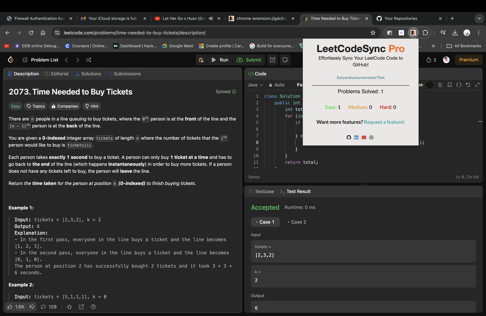

# LeetCodeSync Pro - Sync your LeetCode Solutions with GitHub

## What is LeetHub-3.0?

LeetCodeSync Pro is a powerful tool that automates the synchronization of your LeetCode coding solutions with GitHub repositories. Say goodbye to manual syncing and hello to more time for coding and innovation. Forked from a renowned predecessor, LeetCodeSync Pro is designed to streamline your coding workflow.


## Why LeetCodeSync Pro?

Tired of juggling between LeetCode and GitHub to manage your coding solutions? LeetCodeSync Pro provides a seamless solution by automatically pushing your code to GitHub when you pass all tests on a LeetCode problem. Spend more time solving problems and less time on manual tasks.

## Screenshot

<h1 align="center">
    
</h1>

## Supported UI

LeetCodeSync Pro is compatible with two different LeetCode UIs. For the best experience, we recommend using the following:

1. **old layout** or
2. new **"dynamic layout"**


## Setup

1. After installing the LeetHub, launch the plugin
2. Click on **"Authorize with GitHub"** to set up your account with LeetHub
3. Setup an existing/new repository with LeetHub (private by default) by clicking **"Get Started"**
4. Begin Leetcoding! To view your progress, simply click on the extension!


## Supported npm commands

```bash
npm run               # Show available commands
npm run setup         # Install dependencies
npm run format        # Auto-format JavaScript, HTML/CSS
npm run format-test   # Test if code is formatted properly
npm run lint          # Lint JavaScript
npm run lint-test     # Test if code is linted properly
```

## Contribution

Please help to further improve this awesome plugin! We would appreciate your support. Your pull requests are welcome!

Don't forget to star this repository for further development of new features. If you want a particular feature, simply [request](https://github.com/Satyamkumarnavneet/LeetCodeSync-Pro/labels/newfeature) for it!

